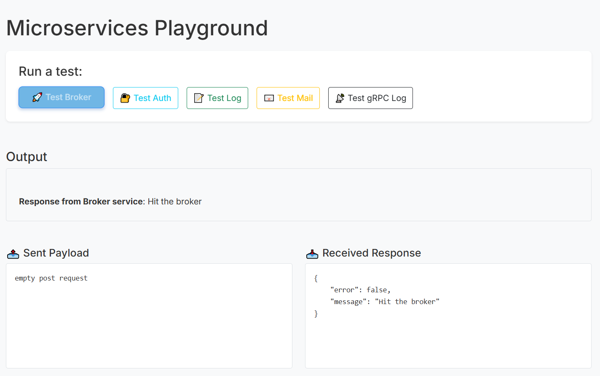
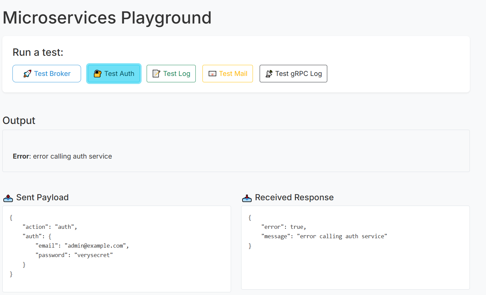
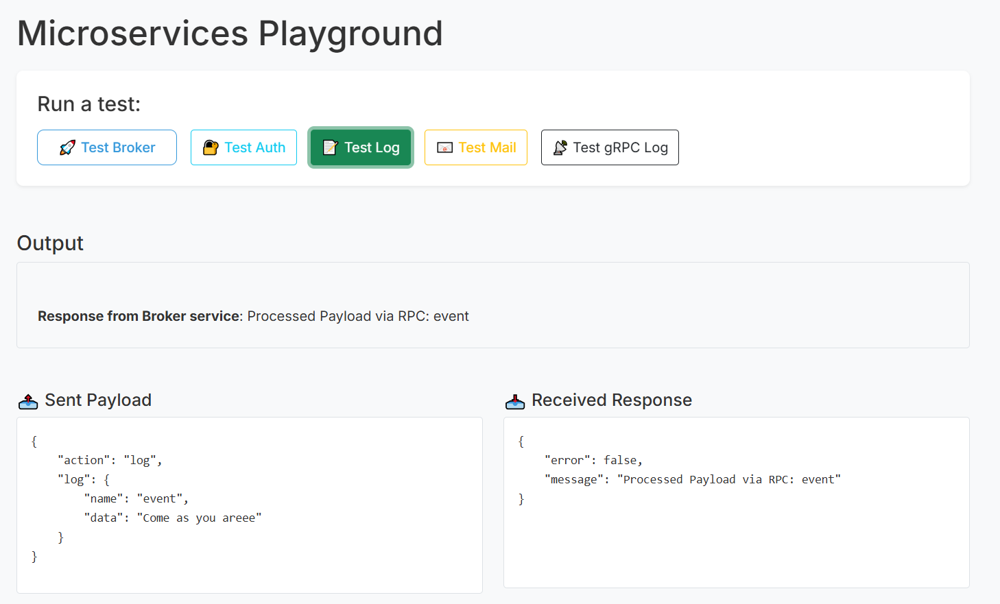
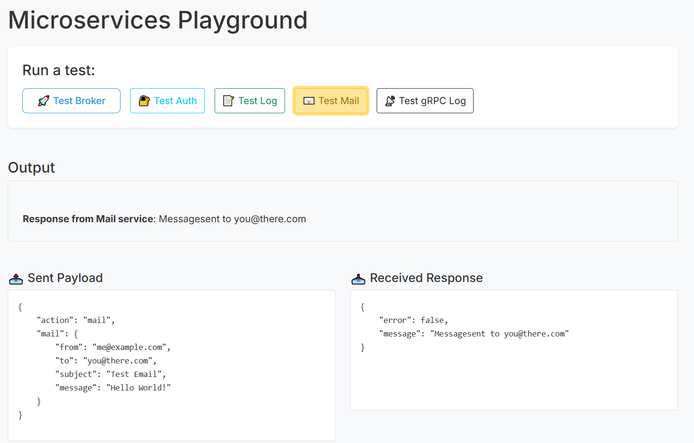
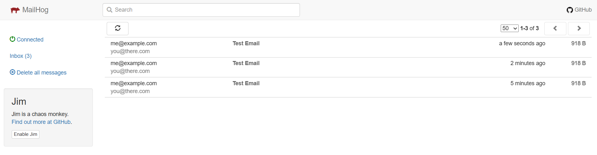
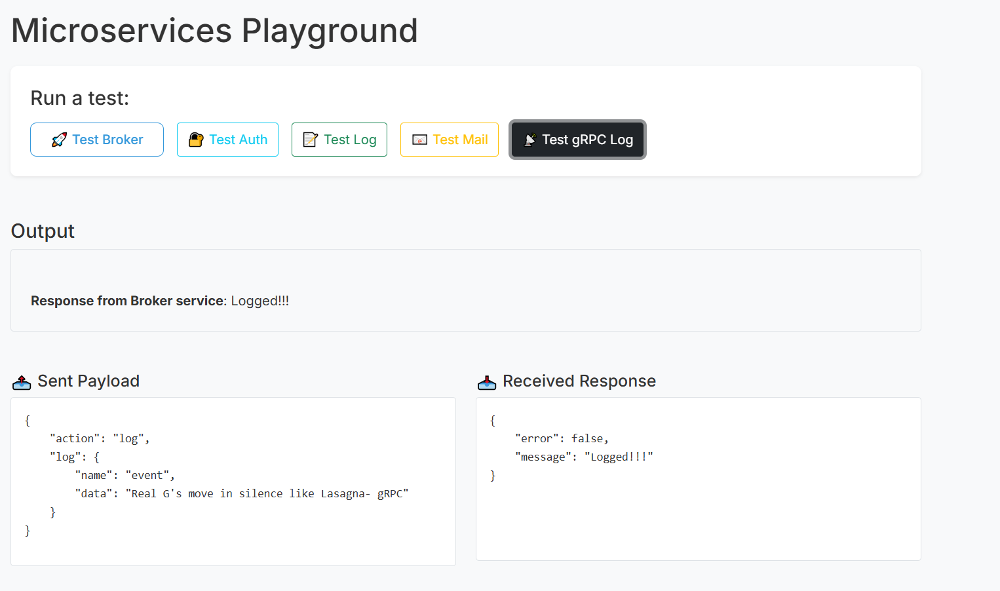

# GoFlow 🐹🌀
 GoFlow is a hands-on microservices project built using Golang, designed to explore real-world backend architecture. It features independent services communicating over both HTTP and gRPC, integrates PostgreSQL, MongoDB, and RabbitMQ, and supports local email testing via Mailhog. 

With a frontend UI to demonstrate service interactions and a clean Makefile workflow for managing containers, GoFlow provides a practical look at scalable, event-driven systems.


## 📚 Table of Contents

- 🌟[ Overview](#-overview)
- 🧩[Services Overview](#-services-overview)
  - [🔐 Authentication Service](#-authentication-service)
  - 🔀 [Broker Service](#-broker-service)
  - 📧[ Mail Service](#-mail-service)
  - 📝[ Logger Service](#-logger-service)
  - 🎧[ Listener Service](#-listener-service)
- 🔌[ Interservice Communication](#-interservice-communication)
- 🏛️ [ Architecture Diagram ](#-architecture-diagram)
- 🛠️ [Tech Stack](#-tech-stack)
- 🧪[ Getting Started](#-getting-started)
- 📸[ Demo](#demo)
- 🚀[ What's Next](#-whats-next)
- 🤝[ Contributing](#-contributing)


 ## 🌟 Overview
GoFlow is a microservices-based backend system built using Go. It simulates real-world service orchestration with clean service boundaries, asynchronous communication, and containerized deployments.

The project includes multiple services — each with a focused responsibility — connected through HTTP and now also gRPC. It leverages tools like RabbitMQ for message queues, PostgreSQL and MongoDB for persistence, and Mailhog for email testing. Everything is containerized using Docker and controlled through a simple Makefile workflow.


 ## 🧩 Services Overview
 ### 🔐 Authentication Service
 Handles user authentication and management.
 
 Connected to a PostgreSQL database for storing user credentials and session data.
 
 ### 🔀 Broker Service
 Optional single point of entry.
 
 Forwards incoming client requests to the appropriate microservice.
 
 ### 📧 Mail Service
 Uses Mailhog for local email testing.
 
 Sends and previews emails when triggered.
 
 ### 📝 Logger Service
 Captures and stores logs from other services.
 
 Persists log data in MongoDB.
 
 ### 🎧 Listener Service
 Subscribes to events from RabbitMQ.
 
 Processes incoming messages asynchronously, demonstrating event-driven architecture.

## 🔌 Interservice Communication
GoFlow now supports both:

HTTP communication between Broker and services

gRPC for faster, strongly-typed communication between internal services


## 🏛️ Architecture Diagram 

 

 ## 🛠️ Tech Stack
 <b>Language</b>: Go (Golang)
 
 <b>Databases</b>: PostgreSQL, MongoDB
 
 <b>Messaging Queue</b>: RabbitMQ
 
 <b>Email Testing</b>: Mailhog
 
 <b>Containerization</b>: Docker, Docker Compose
 
 <b>Build</b>: Makefile
 
 ## 🧪 Getting Started
 
 ### 1. Clone the repository
 
 `````````
 git clone https://github.com/Adit0507/GoFlow.git
 cd GoFlow
 `````````
 ### 2. Build and run all services
 `````````
 make up_build
 `````````
 - Build all Go binaries
 - Stop any running Docker containers
 - Start all containers with fresh builds
 
 
 ### 3. Start services without rebuilding
 `````````
 make up
 `````````
 
 ### 4. Stop all services 
 `````````
 make down
 `````````
 
 ### 5. Launch the Front-end 
 `````````
 make start
 `````````
 to stop frontend
 `````````
 make stop
 `````````
 
## Demo

Showing the working of <b>GoFlow's</b> microservices in action.

###  <i>Broker Service </i>


### 🔒 <i>Authentication Service (Requires fixing 🔨) </i>



### <i>Logger Service (happening via gRPC 🔥) </i>



### 📧 <i>Mail Service </i> 


<br />
<b> MailHog (For Email Testing) </b>


### <i> gRPC Log </i>


## 🚀 What's Next
Coming up next:

- Deploying on Kubernetes or Docker Swarm

## 🤝 Contributing
This is a passion project built to explore backend architecture. Contributions, suggestions, or just feedback are all welcome!
